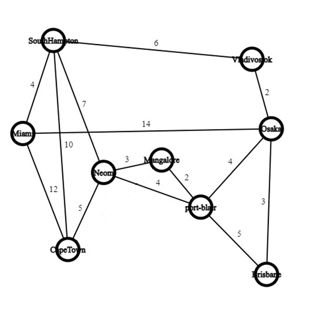

# Shipment Logistic Optimizer

A C++ program designed to optimize the logistics of shipments across various ports using algorithms like **Floyd-Warshall** for route optimization, **0/1 Knapsack** for cargo selection based on weight and value, and **KMP String Matching** for port availability validation. This program allows users to manage shipments efficiently by calculating the best routes, estimating transportation costs, and generating digital invoices.

## Features

- **Knapsack Algorithm**: Optimizes the selection of items for shipment based on weight and value.
- **Floyd-Warshall Algorithm**: Computes the shortest paths between ports to minimize transportation costs.
- **KMP String Search**: Verifies if the specified ports are available for transportation.
- **Port Management**: Supports multiple ports worldwide for efficient shipment management.
- **Digital Invoice Generation**: Provides a detailed invoice with income, transportation costs, GST, and profit.
- **User-Friendly Menu**: Interactive options for entering items, managing weights, calculating routes, and generating bills.

## Ports Supported
The program currently supports the following ports:

- Mangalore (India)
- Port Blair (India)
- Vladivostok (Russia)
- Port of Neom (Saudi Arabia)
- Southampton (UK)
- Cape Town (South Africa)
- Miami (USA)
- Osaka (Japan)
- Brisbane (Australia)

## Graphs

### Port Connectivity Graph

The following graph represents the connected ports and the cost of transportation between them. Each node corresponds to a port, and the edges indicate the routes between ports, with weights representing the cost of traversal. This graph is a key input for the **Floyd-Warshall algorithm**, which calculates the shortest paths between all pairs of ports.

<p align="center">
   
   
</p>

## Prerequisites

- A C++ compiler (e.g., GCC, Clang, or Visual Studio).
- Basic understanding of C++ programming.

## How to Use

1. Clone this repository:
   ```bash
   git clone https://github.com/vanshulagarwal/ShipmentLogisticOptimizer.git
   cd ShipmentLogisticOptimizer
   ```

2. Compile the program:
   ```bash
   g++ -o shipment_logistic_optimizer ShipmentLogisticOptimizer.cpp
   ```

3. Run the program:
   ```bash
   ./shipment_logistic_optimizer
   ```

4. Follow the menu options to:
   - Enter and manage shipment items.
   - Calculate optimal shipment routes.
   - Generate a digital invoice.

## Program Menu

1. **Enter Items**: Input weights and values for shipment items.
2. **Add New Items**: Add additional items to the existing shipment.
3. **Delete Items**: Remove specific items from the shipment.
4. **Send Shipment**: Calculate the optimal route and transportation cost.
5. **Generate Bill**: Generate a detailed invoice for the shipment.
6. **Exit**: Exit the program.

## Algorithms Used

- **Floyd-Warshall Algorithm**: Used to calculate the paths with minimum transportation cost between all pairs of ports.
- **0/1 Knapsack Algorithm**: Determines the most valuable combination of items that fit within the ship's capacity.
- **KMP String Search**: Ensures accurate port name matching to validate port availability for shipments.

## Example Output

```
*******************************
 WELCOME TO OUR SHIPMENT SYSTEM
*******************************
MAIN MENU
1. Enter Items
2. Add New Items
3. Delete Items
4. Send Shipment
5. Generate Bill
6. Exit
Enter your choice: 1

                +-------------------------------------+
                |             Port Name               |
                +-------------------------------------+
                |          Mangalore(India)           |
                |          Port Blair(India)          |
                |          Vladivostok(Russia)        |
                |          Port Of Neom(Saudi Arabia) |
                |          Southampton(UK)            |
                |          Cape Town(SA)              |
                |          Miami(USA)                 |
                |          Osaka(Japan)               |
                |          Brisbane(Australia)        |
                +-------------------------------------+
Enter the port name: mangalore

Ship is available for transportation from that port.....


Enter the number of items: 3
Enter the weight and value of each item:
Item 1 weight: 5
Item 1 value: 10
Item 2 weight: 15
Item 2 value: 20
Item 3 weight: 12
Item 3 value: 15
Enter the capacity of ship: 30
_______
Income from selected items is Rs 35 K
Items selected :
   Item no. 3
   Item no. 2
________
MAIN MENU
1. Enter Items
2. Add New Items
3. Delete Items
4. Send Shipment
5. Generate Bill
6. Exit
Enter your choice: 4

                +---------+----------------------------+
                |  Code   |          Port Name         |
                +---------+----------------------------+
                |    0    |  Mangalore(India)          |
                |    1    |  Port Blair(India)         |
                |    2    |  Vladivostok(Russia)       |
                |    3    |  Port of Neom(Saudi Arabia)|
                |    4    |  Southampton(UK)           |
                |    5    |  Cape Town(SA)             |
                |    6    |  Miami(USA)                |
                |    7    |  Osaka(Japan)              |
                |    8    |  Brisbane(Australia)       |
                +---------+----------------------------+

  Enter the destnation port Code you want deliver : 5
Minimum Transportation Cost = 8
Best Route : 
Mangalore --> Port of Neom --> Cape Town
MAIN MENU
1. Enter Items
2. Add New Items
3. Delete Items
4. Send Shipment
5. Generate Bill
6. Exit
Enter your choice: 5
 Your Digital Invoice


***********************************************************************
*                              INVOICE                                *
***
    FROM    Mangalore    TO    Cape Town
***********************************************************************
    Time                   : Mon Dec 30 03:33:20 2024


    Income from selected Items                         Rs 35000
    Items total weight loaded                        : 27 Tonnes
    Total Transportation Cost                        : 8000
    Remaining Amount                                   Rs 27000
    GST(18%)                                           Rs. 4860
    Total Profit                                       Rs. 22140
***MAIN MENU
1. Enter Items
2. Add New Items
3. Delete Items
4. Send Shipment
5. Generate Bill
6. Exit
Enter your choice: 6
```


